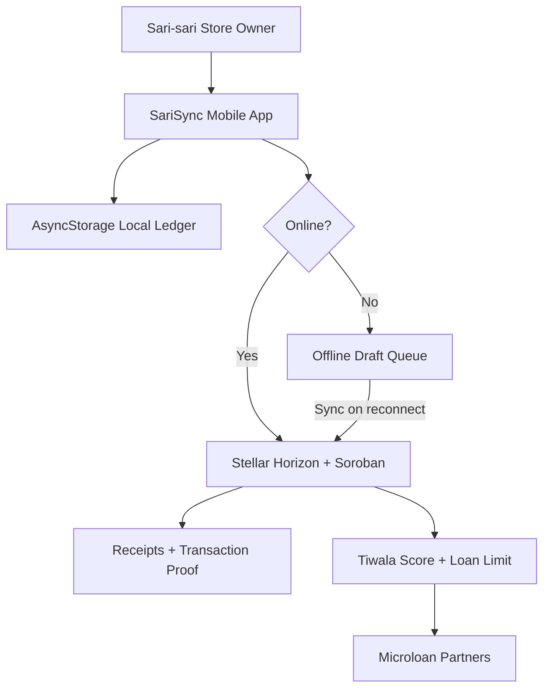

# SariSync Ledger

<p align="center">
  
</p>

<p align="center">
  <strong>A mobile-first sari-sari store cashbox, ledger, and microfinance app secured by Stellar.</strong>
</p>

<p align="center">
  <a href="https://github.com/thanreiz/stellar-ph-hackathon"></a>
  <a href="https://stellar.expert/explorer/testnet/account/GDKM43OI2ZNZIPHPMU7TZQIFHY3VK4MBYKARH27B4PJ4Z22FWYVVVPX2"></a>
  <a href="https://stellar.expert/explorer/testnet/contract/CDUE6YHQ5OIIPBLROKUXVIW7HWTPPI4NVNYWA2IKARD6JNH5AYUUQ2OR"></a>
  <a href="LICENSE"></a>
  <a href="https://github.com/thanreiz/stellar-ph-hackathon/commits/main"></a>
</p>

---

## Build on Stellar Philippines Hackathon

SariSync Ledger was built for the **Build on Stellar Philippines Hackathon** by **Rise In** and the **Stellar Development Foundation**.

> **Judge links**
>
> - Demo video: `[add demo video here]`
> - Pitch deck: `[add pitch deck here]`
> - Android/iPhone demo screenshots: `[add pictures here]`
> - Testnet store wallet: [`GDKM43OI2ZNZIPHPMU7TZQIFHY3VK4MBYKARH27B4PJ4Z22FWYVVVPX2`](https://stellar.expert/explorer/testnet/account/GDKM43OI2ZNZIPHPMU7TZQIFHY3VK4MBYKARH27B4PJ4Z22FWYVVVPX2)
> - Soroban contract: [`CDUE6YHQ5OIIPBLROKUXVIW7HWTPPI4NVNYWA2IKARD6JNH5AYUUQ2OR`](https://stellar.expert/explorer/testnet/contract/CDUE6YHQ5OIIPBLROKUXVIW7HWTPPI4NVNYWA2IKARD6JNH5AYUUQ2OR)

---

## Problem

Sari-sari stores are the everyday retail backbone of the Philippines, but many still operate with paper notes, cash screenshots, manual utang lists, and informal lending.

| Pain point | What it costs |
| --- | --- |
| Paper sales records | Lost receipts, hard reconciliation, weak proof of cash flow |
| Cash and e-wallet payments split across apps | Store owners cannot see one clear business picture |
| No verified credit history | Good stores struggle to access fair working capital |
| Intermittent connectivity | Digital finance tools stop working exactly when stores still need to operate |
| Supplier cash pressure | Stores can miss restocking opportunities when cash is temporarily low |

The root problem: daily store activity is disconnected from trustworthy financial proof. SariSync turns ordinary benta, gastos, loan, and bayad actions into a simple local ledger with optional Stellar proof in the background.

## Vision

Make blockchain feel like normal finance for Filipino micro-merchants.

SariSync should feel like a warm, familiar cashbox app first. Stellar works quietly underneath as the security and proof layer for wallet balance, transaction verification, supplier settlement, and credit history.

## Purpose

SariSync helps a sari-sari store owner:

- Record **Benta** and **Expenses**
- Track cash, GCash, Maya, and bank-transfer spending
- Connect a Stellar/Freighter wallet before using finance features
- Request microloans from partner lenders
- Pay suppliers and repay utang
- Generate receipts and proof documents
- Continue useful work offline, then sync when internet returns

## Screenshots

> Main dashboard / Kaha
> `[add pictures here]`

> Tracker, Utang, and Proof screens
> `[add pictures here]`

> Offline mode and wallet connection
> `[add pictures here]`

---

## Features

### Store Experience

- Mobile-first Expo app for Android Studio emulator and iPhone demos
- Warm fintech UI inspired by Filipino-friendly finance apps
- Big readable business numbers for sales, expenses, trust score, and loan limit
- Light and dark modes
- Native phone keyboard support for all amount and wallet inputs

### Ledger and Cash Flow

- Benta logging for daily sales
- Expense tracking across cash, GCash, Maya, and bank transfer
- Tindahan Cash summary combining synced sales and PHPC balance
- Receipt and document generation through native mobile sharing

### Wallet and Stellar Layer

- Stellar/Freighter-style wallet gate before app usage
- Live XLM and PHPC balance fetching through Horizon
- Testnet microloan funding from partner lender accounts
- Cash In flow for XLM to PHPC path payments
- Cash Out demo flow for local e-wallet/bank payout simulation
- Transaction proof hidden by default, available through Proof details

### Offline Mode

- Online/offline detection through NetInfo
- Local Benta, expense, supplier invoice, and repayment drafts
- Clear offline banner when internet is unavailable
- Online ledger numbers hidden while offline
- Drafts remain visible so the app still has purpose without connection

### Credit and Soroban

- Tiwala Score and loan limit logic
- Soroban credit profile sync on Stellar Testnet
- Outstanding loan balance tracking
- Mainnet-safe Soroban passthrough when the demo is not using the testnet contract

---

## Tech Stack

| Layer | Technology |
| --- | --- |
| Mobile app | Expo SDK 52, React Native 0.76 |
| Navigation | Expo Router |
| Local storage | AsyncStorage |
| Network awareness | `@react-native-community/netinfo` |
| Blockchain | Stellar SDK, Horizon, Soroban RPC |
| Smart contract | Rust / Soroban |
| Camera | Expo Camera |
| Documents | Expo FileSystem + Expo Sharing |
| Tests | Node.js native test runner |

---

## Run Locally

Prerequisites:

- Node.js 20+
- npm 10+
- Android Studio for Android demo
- Expo Go or iOS tooling for iPhone demo

Install dependencies:

```bash
npm install
```

Start Expo:

```bash
npm start
```

Run on Android Studio emulator:

```bash
npm run android
```

Run on iPhone:

```bash
npm run ios
```

Run tests:

```bash
npm test
```

Run Expo project checks:

```bash
npm run doctor
```

> Note: this repo contains a native `android/` folder. Expo Doctor may warn that app config fields need prebuild syncing when native folders are present.

---

## Environment

Create a local `.env` file from `.env.example`:

```bash
cp .env.example .env
```

Required demo variables:

```env
EXPO_PUBLIC_HORIZON_URL=https://horizon-testnet.stellar.org
EXPO_PUBLIC_STELLAR_NETWORK=testnet
EXPO_PUBLIC_STORE_PUBLIC_KEY=GDKM...
EXPO_PUBLIC_STORE_SECRET_KEY=SD...
EXPO_PUBLIC_PHPC_ISSUER=GB...
EXPO_PUBLIC_USDC_ISSUER=GB...
EXPO_PUBLIC_SOROBAN_CONTRACT_ID=CDUE...
```

Seed lender liquidity for a repeatable demo:

```bash
npm run seed:lenders
```

---

## Stellar Testnet

| Item | Value |
| --- | --- |
| Your wallet | [`GCTSKXUGU2MG6A6B53YMSLLVO4UGATKW367EB6FV6OW7ZPOLJZO6W2AH`](https://stellar.expert/explorer/testnet/account/GCTSKXUGU2MG6A6B53YMSLLVO4UGATKW367EB6FV6OW7ZPOLJZO6W2AH) |
| Store wallet | `GDKM43OI2ZNZIPHPMU7TZQIFHY3VK4MBYKARH27B4PJ4Z22FWYVVVPX2` |
| Soroban contract | `CDUE6YHQ5OIIPBLROKUXVIW7HWTPPI4NVNYWA2IKARD6JNH5AYUUQ2OR` |
| Network | Stellar Testnet |
| Contract source | [`contracts/sarisync_contract/src/lib.rs`](contracts/sarisync_contract/src/lib.rs) |

Testnet explorer links:

| Proof | Link |
| --- | --- |
| Your Wallet | [View on Stellar Expert](https://stellar.expert/explorer/testnet/account/GCTSKXUGU2MG6A6B53YMSLLVO4UGATKW367EB6FV6OW7ZPOLJZO6W2AH) |
| Store Wallet | [View on Stellar Expert](https://stellar.expert/explorer/testnet/account/GDKM43OI2ZNZIPHPMU7TZQIFHY3VK4MBYKARH27B4PJ4Z22FWYVVVPX2) |
| Soroban Contract | [View on Stellar Expert](https://stellar.expert/explorer/testnet/contract/CDUE6YHQ5OIIPBLROKUXVIW7HWTPPI4NVNYWA2IKARD6JNH5AYUUQ2OR) |
| XLM to USDC to PHPC Swap TX | [f15dcb8c...7521f7](https://stellar.expert/explorer/testnet/tx/f15dcb8c9b72d9d99760521754e4d0ead16a29af1c26c7312079e3489f7521f7) |
| USDC/PHPC AMM Pool | [23929836...c6dadf](https://stellar.expert/explorer/testnet/liquidity-pool/239298365aa378b7ba956d4a6fc865ed039dd8b25271dee62668be63f1c6dadf) |
| PHPC Funding TX | [90aec9cb...efc9cd](https://stellar.expert/explorer/testnet/tx/90aec9cbbd50d341dcffaba8bac1cf5dfeda102ac466e19173b692c157efc9cd) |

## Stellar Mainnet

Mainnet proof links for the public demo setup:

| Proof | Link |
| --- | --- |
| Your Wallet | [View on Stellar Expert](https://stellar.expert/explorer/public/account/GCTSKXUGU2MG6A6B53YMSLLVO4UGATKW367EB6FV6OW7ZPOLJZO6W2AH) |
| Store/Issuer Wallet | [View on Stellar Expert](https://stellar.expert/explorer/public/account/GDKM43OI2ZNZIPHPMU7TZQIFHY3VK4MBYKARH27B4PJ4Z22FWYVVVPX2) |
| 1,000 PHPC Mint TX | [1c220fef...eadf54c](https://stellar.expert/explorer/public/tx/1c220fefa9bded36c43c03d395f4df0f1042058899e90d50b4fcbf68ceadf54c) |
| XLM/PHPC DEX Offer TX | [15f45ca3...240e7](https://stellar.expert/explorer/public/tx/15f45ca31c68de33a6268a225c2ea686048fb6ddbb578566ad2cd99fd14240e7) |

## Soroban Contract

`sarisync_contract` stores the credit profile for a sari-sari store.

Exported functions:

- `update_profile(store, score, loan_limit, outstanding_balance) -> bool`
- `get_profile(store) -> Option<(score, loan_limit, outstanding_balance)>`

The app uses this contract to keep the Tiwala Score, loan limit, and outstanding balance verifiable on testnet while keeping blockchain details hidden from the main user flow.

---

## Demo Flow

1. Connect a Stellar wallet.
2. Open **Kaha** to see Store Cash, Benta, Expenses, Tiwala Score, and Limit.
3. Record Benta and Expenses using the native phone keyboard.
4. Open **Tracker** to view business movement and microloan offers.
5. Open **Utang** to review loans and bayad drafts.
6. Open **Proof** to generate receipts or view transaction details.
7. Turn Wi-Fi off and confirm local drafts still work.
8. Turn Wi-Fi back on and confirm online mode returns.

## Architecture



---

## Roadmap

| Phase | Focus |
| --- | --- |
| Division 1 | UI/UX polish and mobile demo readiness |
| Division 2 | XLM, USDC, and PHPC conversion clarity |
| Division 3 | Stronger Stellar transaction proof and explorer flows |
| Division 4 | Production-ready lending and supplier partner integrations |
| Division 5 | Mainnet launch planning after testnet validation |

---

## Team

**Ethan Dreiz Baltazar**
Builder, designer, and developer of SariSync Ledger.

- Instagram: [@thanreiz](https://www.instagram.com/thanreiz)
- LinkedIn: [thanreiz](https://www.linkedin.com/in/thanreiz)
- GitHub: [thanreiz](https://github.com/thanreiz)

---

> Project status: Demo-ready mobile prototype on Expo SDK 52 with Stellar Testnet integration, offline-first local records, and Soroban-backed credit proof.
