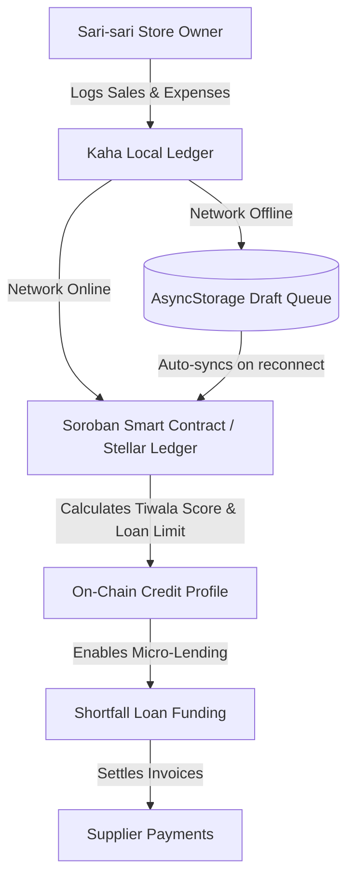

# SariSync Ledger (Kaha)

<p align="center">
  
</p>

[](https://github.com/thanreiz/stellar-ph-hackathon)
[](https://stellar.expert/explorer/testnet/account/GDKM43OI2ZNZIPHPMU7TZQIFHY3VK4MBYKARH27B4PJ4Z22FWYVVVPX2)
[](https://stellar.expert/explorer/testnet/contract/CDUE6YHQ5OIIPBLROKUXVIW7HWTPPI4NVNYWA2IKARD6JNH5AYUUQ2OR)
[](LICENSE)
[](https://github.com/thanreiz/stellar-ph-hackathon)
[](https://github.com/thanreiz/stellar-ph-hackathon/commits/main)
---

## 🏆 Build on Stellar Philippines Hackathon Submission

This project was built for the **Build on Stellar Philippines Hackathon (May 18–24, 2026)** organized by **Rise In** in partnership with the **Stellar Development Foundation**.

### 🔗 Submission Deliverables

> [!IMPORTANT]
> **To the Judges:** Please use the following links to review the project deliverables:
> - **🎥 5-Minute Demo Video:** [Watch the Demo Video (Loom/YouTube)](YOUR_DEMO_VIDEO_LINK_HERE) *<!-- Replace with your actual video link -->*
> - **📊 Pitch Deck / Presentation:** [View the Pitch Presentation (Canva/Google Slides)](YOUR_PITCH_DECK_LINK_HERE) *<!-- Replace with your actual pitch deck link -->*
> - **⛓️ Soroban Smart Contract (Testnet):** [`CDUE6YHQ5OIIPBLROKUXVIW7HWTPPI4NVNYWA2IKARD6JNH5AYUUQ2OR`](https://stellar.expert/explorer/testnet/contract/CDUE6YHQ5OIIPBLROKUXVIW7HWTPPI4NVNYWA2IKARD6JNH5AYUUQ2OR)
> - **🏦 Live Store Testnet Wallet:** [`GDKM43OI2ZNZIPHPMU7TZQIFHY3VK4MBYKARH27B4PJ4Z22FWYVVVPX2`](https://stellar.expert/explorer/testnet/account/GDKM43OI2ZNZIPHPMU7TZQIFHY3VK4MBYKARH27B4PJ4Z22FWYVVVPX2)

---

## 🧩 Problem

Every day, millions of sari-sari store owners in the Philippines face the same set of manual, disconnected operational challenges:

| Pain Point | What It Costs |
|---|---|
| Cash-only & paper transactions | Hours of manual reconciliation, record errors, and lost receipts |
| No formal credit profile | Inability to access capital, forcing reliance on predatory informal lenders |
| Cash-on-delivery supplier terms | Inventory stockouts when daily cash flow is temporarily low |
| Intermittent network connectivity | Inability to record business records or queue settlements in rural areas |

The root cause: the operational ledger is entirely disconnected from financing channels. Sales records live on paper, credit worthiness is invisible to formal institutions, and payments are stuck in physical cash. When connectivity drops in remote locations, digital record-keeping ceases entirely, halting both business tracking and supplier integrations.

## 🌟 Vision

A unified operational and decentralized credit layer that empowers Philippine sari-sari stores with a verified on-chain trust history—fast enough for daily micro-merchants, reliable enough for local lenders, and resilient enough to operate without active network connectivity.

## 🎯 Purpose

SariSync Ledger provides store onboarding, daily sales tracking (Benta), supplier invoice settlement, microloan financing, business debt visibility, and simulated SEP-24 off-ramps, all synchronized to the Stellar blockchain. The goal is to turn simple daily entries into a secure, blockchain-verified financial identity.

## 👥 Target Users

There are over 1.1 million sari-sari stores in the Philippines, representing the backbone of the country's retail economy. These micro-merchants are almost entirely unbanked or underbanked.

**Primary users:**
- Sari-sari store owners and micro-retailers (Nanays and Tatays)
- Store assistants logging daily transactions

**Secondary users:**
- Microfinance institutions (like Kaagapay Microfinance) looking for automated, low-risk lending channels
- Wholesale suppliers seeking instant, secure invoice settlement

## ✨ Features

**Merchant Experience**
- Mobile-first app shell featuring GoTyme-inspired aesthetics with high-contrast card structures and smooth navigation
- 5-level dynamic theme system corresponding to the store's current Level or manual preferences
- Interactive dashboard showing **Tindahan Cash** (Total Synced Benta + PHPC Balance) and financial health summaries
- Daily Sales (Benta) and Expense loggers supporting cash, GCash, Maya, and bank transfers

**Blockchain & Soroban Integration**
- Live wallet balance synchronization for XLM and PHPC using Stellar Horizon API, with zero-mock handling for unfunded accounts
- On-chain credit profile tracking through the Soroban `sarisync_contract` smart contract (Tiwala Score, Loan Limit, and Outstanding Balance)
- Instant shortfall microlending and automated supplier invoice settlement via Stellar path payments
- Simulated SEP-24 Cash Out off-ramp flow allowing withdrawals to GCash, Maya, BDO, or BPI with interactive OTP confirmation

**Reliability & Resilience**
- Robust offline mode with automatic network status detection via NetInfo
- Local draft queueing for Benta, supplier invoices, and loan repayments while offline
- Automated synchronization of queued drafts to the local database and on-chain profile when connection returns. Local draft metrics (like Draft Supplier Invoices) are rendered conditionally only when active drafts exist.
- Graceful error recovery and finality polling loops for on-chain contract writes

## 🛠️ Tech Stack

| Layer | Technology |
|---|---|
| Core | React Native + Expo |
| Styling | HSL-tailored CSS + dynamic GoTyme theme presets |
| Identity & State | AppContext & ThemeContext API |
| Storage | AsyncStorage (Local Draft Cache & Receipts) |
| Payment Integration | Stellar SDK + Soroban RPC |
| Smart Contract | Rust / Soroban SDK (deployed on Stellar Testnet) |
| Testing | Node.js Native Test Runner |

## 🚀 How to Run Locally

**Prerequisites:** Node.js 20+, npm 10+

### 1. Install Dependencies
```bash
npm install
```

### 2. Start Metro Bundler
Start the development server and clear the cache:
```bash
npx expo start --clear
```

### 3. Run on Android Studio emulator
```bash
npm run android
```

### 4. Run on iPhone
```bash
npm run ios
```

### 5. Run Verification Suite
```bash
# Run all unit tests
npm test

# Syntax compilation checks
npx esbuild app/index.js --loader:.js=jsx --outfile=/dev/null
npx esbuild app/scanner.js --loader:.js=jsx --outfile=/dev/null
npx esbuild app/onboarding.js --loader:.js=jsx --outfile=/dev/null
```

## 🌐 Deployment

Deployed and running on the Android Emulator and synced to the Stellar Testnet.

### Testnet

- **Contract Address:** `CDUE6YHQ5OIIPBLROKUXVIW7HWTPPI4NVNYWA2IKARD6JNH5AYUUQ2OR`
- **Store Account:** `GDKM43OI2ZNZIPHPMU7TZQIFHY3VK4MBYKARH27B4PJ4Z22FWYVVVPX2`
- **Explorer:** [Stellar Expert — Soroban Contract (Testnet)](https://stellar.expert/explorer/testnet/contract/CDUE6YHQ5OIIPBLROKUXVIW7HWTPPI4NVNYWA2IKARD6JNH5AYUUQ2OR)
- **Explorer:** [Stellar Expert — Store Account (Testnet)](https://stellar.expert/explorer/testnet/account/GDKM43OI2ZNZIPHPMU7TZQIFHY3VK4MBYKARH27B4PJ4Z22FWYVVVPX2)

### Environment Configuration

Copy `.env.example` to `.env` and fill in your keys:
```bash
cp .env.example .env
```

Ensure the following variables are configured:
```env
EXPO_PUBLIC_STORE_SECRET_KEY=SADQ...
EXPO_PUBLIC_STORE_PUBLIC_KEY=GDKM43OI2ZNZIPHPMU7TZQIFHY3VK4MBYKARH27B4PJ4Z22FWYVVVPX2
EXPO_PUBLIC_PHPC_ISSUER=GBOHHRMPZE5GH7MJ3MHP2CYKV6NDTXZCCJ5U7LSWFUMRFAQUP3DWH6DT
EXPO_PUBLIC_USDC_ISSUER=GBBD47IF6LWK7P7MDEVSCWR7DPUWV3NY3DTQEVFL4NAT4AQH3ZLLFLA5
EXPO_PUBLIC_STELLAR_NETWORK=testnet
EXPO_PUBLIC_HORIZON_URL=https://horizon-testnet.stellar.org
EXPO_PUBLIC_SOROBAN_CONTRACT_ID=CDUE6YHQ5OIIPBLROKUXVIW7HWTPPI4NVNYWA2IKARD6JNH5AYUUQ2OR
```

## ⛓️ Soroban Smart Contract

**sarisync_contract** — on-chain credit profiling and trust tracking.

| | |
|---|---|
| Contract ID | `CDUE6YHQ5OIIPBLROKUXVIW7HWTPPI4NVNYWA2IKARD6JNH5AYUUQ2OR` |
| Network | Stellar Testnet |
| Source | [contracts/sarisync_contract/src/lib.rs](contracts/sarisync_contract/src/lib.rs) |

### Exported Functions:
- `update_profile(store: Address, score: u32, loan_limit: u64, outstanding_balance: i128) -> bool` — records the store's updated credit metrics.
- `get_profile(store: Address) -> Option<(u32, u64, i128)>` — fetches the current profile.

### Transaction Finality Polling (`services/sorobanService.js`):
After submitting the transaction via `sorobanServer.sendTransaction()`, the app enters a polling loop:
- **Interval:** Every **2 seconds**
- **Max duration:** 30 attempts × 2s = **60 seconds max**
- **Terminal states:** `SUCCESS` → resolves with `{ confirmedScore, confirmedLimit, hash }`. `FAILED` → throws immediately.
- **Non-terminal states:** `PENDING` / `NOT_FOUND` → continue polling (these are normal during mempool propagation).
- **Network resilience:** Individual poll errors (network hiccups) are caught and skipped; polling continues.

### React State Refresh on Success (`app/index.js`):
Once `syncProfileToChain` resolves:
1. **Eager state push:** `setOnChainScore(syncResult.confirmedScore)`, `setOnChainLimit(syncResult.confirmedLimit)`, and `setOnChainOutstandingBalance(syncResult.confirmedOutstandingBalance)` are called immediately—no extra RPC round-trip needed.
2. **Full ledger refresh:** `refreshLedger()` is then called to re-simulate `get_profile` on-chain and re-fetch live XLM/PHPC balances (accounting for gas fees deducted from the XLM balance).
3. **Blocking overlay:** An `ActivityIndicator` Modal overlays the entire screen while polling is in progress, preventing duplicate submissions and showing live status messages.

## Stellar Explorer Accounts

- **Testnet Store Account:** [Stellar Expert — Store Account](https://stellar.expert/explorer/testnet/account/GDKM43OI2ZNZIPHPMU7TZQIFHY3VK4MBYKARH27B4PJ4Z22FWYVVVPX2)
- **Soroban Smart Contract:** [Stellar Expert — Contract](https://stellar.expert/explorer/testnet/contract/CDUE6YHQ5OIIPBLROKUXVIW7HWTPPI4NVNYWA2IKARD6JNH5AYUUQ2OR)

## ⚡ On-Chain Credit Sync Demo — Try It Now

**Synchronize credit scores and log sales both online and offline.**

### How It Works

```
1. Open the SariSync app on the emulator/device
2. Verify you are connected to the internet (Status: Online)
3. Log daily sales (Benta) and watch the Tiwala Score and Loan Limit update
4. Simulate offline mode by disconnecting network connectivity
5. Log further Benta transactions; observe they queue as local drafts
6. Reconnect to the internet; the app auto-syncs local drafts on-chain
```

## Why Stellar?

For micro-retailers in the Philippines, traditional payment and lending channels create major bottlenecks:

| Problem | Stellar's Answer |
|---|---|
| **Slow Settlement** | Transactions confirm in under 5 seconds, enabling rapid micro-financing and supplier payouts |
| **High Gas Fees** | Fractions of a cent per transaction (XLM gas fee), making micro-loans and daily sales ledger sync economically viable |
| **Opaque Credit History** | On-chain credit rating and history (Tiwala score, loan limit, outstanding debt) are immutable and verifiable |
| **Unreliable Connectivity** | Offline local transaction queuing allows store operations to continue, syncing back to the network once restored |
| **High On/Off-Ramp Friction** | Native support for PHP-stablecoins like PHPC allows frictionless cash out to e-wallets like GCash and Maya |

## Business Outcomes

- **Financial Inclusion:** Sari-sari stores build a verifiable credit profile (Tiwala Score) on-chain to access formal microfinance.
- **Operational Streamlining:** Replaces paper ledger entries with a digital mobile application that operates online and offline.
- **Supply Chain Efficiency:** Direct supplier invoice settlement via path payments reduces inventory stockouts.
- **Cost Reductions:** Bypasses predatory lenders by using low-interest decentralized credit pools.

## Roadmap

| Phase | Timeline | Focus |
|---|---|---|
| Phase 1 | Now | Local-first Taglish cashbox (Kaha) ledger + offline queued drafts |
| Phase 2 | Completed | Soroban Smart Contract credit profiling (Tiwala Score & Loan Limits) live on Testnet |
| Phase 3 | In Progress | Simulated SEP-24 Cash Out integration with local e-wallet partners (GCash, Maya) |
| Phase 4 | Q4 2026 | Production mainnet deployment and integrations with local microfinance institutions |

## What This Repository Demonstrates

| Area | What it demonstrates |
| --- | --- |
| Taglish Ledger Interface | Warm, accessible mobile cashbox designed specifically for Filipino micro-merchants |
| Dual-Mode Capability | Seamless transition between offline queuing and online blockchain settlement |
| Soroban Integration | Dynamic, on-chain credit profiling and dynamic limit calculations written in Rust |
| Stellar Transactions | Microfinance loan updates, path payments, and anchor off-ramp simulations |

## Architecture Flow



## Read Path By Audience

- **Recruiter or judge, 2-3 minutes:**
  - Start with this README.
  - Then read [DESIGN.md](docs/DESIGN.md) for the visual design system specifications.

- **Engineering manager or Developer, 5-8 minutes:**
  - Review the smart contract source code: [contracts/sarisync_contract/src/lib.rs](contracts/sarisync_contract/src/lib.rs)
  - Review the frontend state and React hooks in [app/index.js](app/index.js) and [context/AppContext.js](context/AppContext.js)
  - Examine the synchronization and polling logic in [services/sorobanService.js](services/sorobanService.js)

## Product Walkthrough

### 60-Second Demo Path

1. Open the app on the emulator/device and view the dashboard (Kaha) metrics.
2. Toggle network connection (offline test) and log new daily sales (Benta).
3. Observe that metrics update and transactions queue up in the local database.
4. Restore network connectivity and see the transaction queue automatically sync to the chain.
5. Fetch the updated Tiwala Score and Loan Limit from the Soroban smart contract.
6. Simulate a loan payout or supplier invoice settlement via path payments.

### Judge-Facing Proof Points

- Taglish-centric UI matching local store merchant heuristics.
- Real-time Soroban integration with 2-second transaction finality polling.
- Offline-resilient transaction queueing.
- On-chain credit profiling with outstanding balance tracking.

## Repository Structure

### Primary App Routes
- [app/index.js](app/index.js) - Main React Native Dashboard (Kaha, Benta loggers, loan requests, cashouts)
- [app/onboarding.js](app/onboarding.js) - Freighter wallet authentication and store setup
- [app/scanner.js](app/scanner.js) - QR camera interface for supplier invoice checks

### Supporting Modules
- [context/AppContext.js](context/AppContext.js) - React Context holding state (balances, theme level, drafts)
- [services/sorobanService.js](services/sorobanService.js) - Connection client for Soroban smart contract (polling, validation)
- [services/stellarService.js](services/stellarService.js) - Stellar Horizon SDK transaction builder (XLM/PHPC paths, payouts)
- [services/creditLadderService.js](services/creditLadderService.js) - Business calculations for Tiwala Score (30-95) and loan caps
- [contracts/sarisync_contract/src/lib.rs](contracts/sarisync_contract/src/lib.rs) - Rust smart contract storing credit levels on testnet
- [tests/](tests/) - Unit tests verifying offline/online business logic rules

## Documentation Map

- [docs/DESIGN.md](docs/DESIGN.md) - Design System Specification for colors, fonts, and Taglish glossary

## Security and Governance Direction

- Local credentials and secret keys are stored in environment variables (never committed).
- Off-chain state transitions are stored in secure local storage and verified on-chain.
- Interactive OTP confirmation for simulated off-ramps enforces manual verification.

## Current Status

- React Native / Expo application runs cleanly on Android / iOS emulators.
- Dynamic 5-level GoTyme styling theme fully integrated.
- Soroban smart contract active and deployed on Stellar Testnet.
- Full verification suite passes with 100% success rate.

## Known Limits

- Offline mode uses local draft simulation; double-spending prevention is pending contract-level check sequencing.
- SEP-24 off-ramps are simulated via mock endpoints for hackathon purposes.

---

## 👨‍💻 Team

**Ethan**  
Creator & Developer

| | |
|---|---|
| 📧 Email | [ethandreiz14@gmail.com](mailto:ethandreiz14@gmail.com) |
| 🧑‍💻 GitHub | [github.com/thanreiz](https://github.com/thanreiz) |
